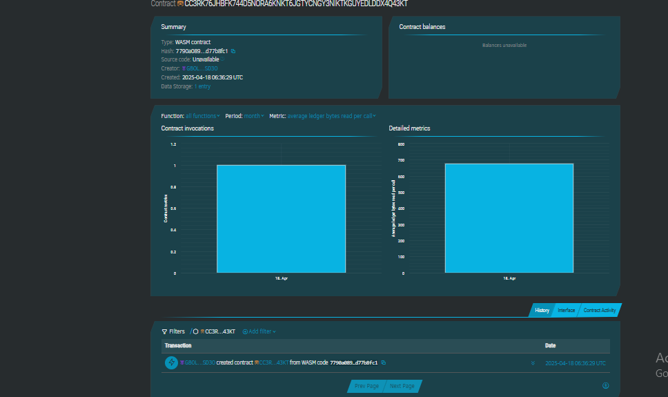

# Smart To-do List with Rewards

## Project Description

A decentralized, smart contract-based to-do list where users can track tasks and earn rewards for completing them. This dApp incentivizes productivity by granting reward points upon task completion. Built using the Soroban SDK on the Stellar network.

---

## Project Vision

To motivate users to manage their daily tasks effectively while introducing them to the world of blockchain through rewards and decentralization. This project aims to merge productivity tools with transparent, on-chain reward mechanisms.

---

## Key Features

- ✅ Add and manage tasks on-chain
- 🧩 Mark tasks as completed
- 🎉 Earn reward points for each task completion
- 📦 View all tasks and current reward score

---

## Future Scope

- 🔐 User-based authentication and private task management
- 🪙 Integration with token economy (convert points to tokens)
- 📱 UI/UX integration for mobile/web frontend
- 📊 Analytics dashboard for task completion streaks and productivity tracking

---

## contract Details
CC3RK76JHBFK744D5NORA6KNKT6JGTYCNGY3NIKTKGUYEDLDDX4Q43KT

